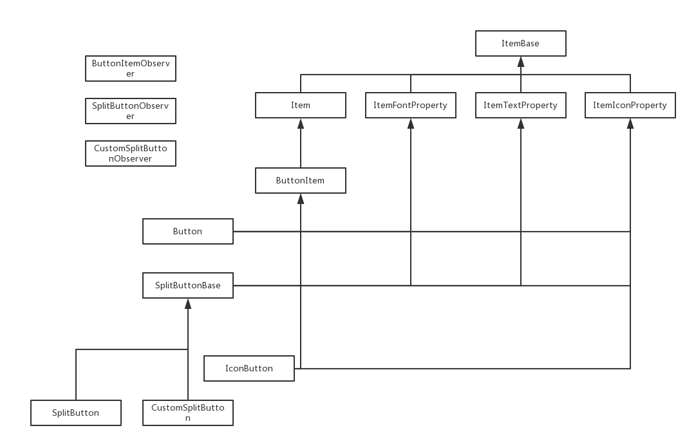

## ButtonItem Inheritance Diagram




## (Button,SplitButton) Examples
### Videos
* Youttube: https://youtu.be/I2uRGDRBfVM

### Example
* [demo](../../Scripts/Tests/dg_button_test.py)

### Testing
```
import Tests.dg_button_test as button_test

class PyMain(object):
    def __init__(self):
        print "PyMain.__init__" #must be print this message
        pass

    def RegisterInterface(self):
        print 'PyMain.RegisterInterface' #must be print this message
        pass
    
    def Initialize(self,reload):
        self.frm=button_test.FormPalette()
        print 'PyMain.Initialize' #must be print this message
        pass

    def FreeData(self):
        self.frm=None
        print 'PyMain.FreeData' #must be print this message
        pass

```

## Class List

* [ButtonItem](ButtonItem.md)  
* [ButtonItemObserver](ButtonItem_Observer.md)
* [Button](Button.md)
* [CustomSplitButton](CustomSplitButton.md)
* [CustomSplitButtonObserver](CustomSplitButton_Observer.md)
* [IconButton](IconButton.md)
* [SplitButton](SplitButton.md)
* [SplitButtonObserver](SplitButtonObserver.md)
* [SplitButtonBase](SplitButtonBase.md)

## Enum List

* [Button.Alignment](Button_Alignment.md)
* [Button.ButtonType](Button_ButtonType.md)
* [Button.FrameType](Button_FrameType.md)
* [IconButton.ButtonForm](IconButton_ButtonForm.md)
* [IconButton.FrameType](IconButton_FrameType.md)  
* [SplitButtonBase.Alignment](SplitButtonBase_Alignment.md) 
* [SplitButtonBase.ButtonForm](SplitButtonBase_ButtonForm.md) 