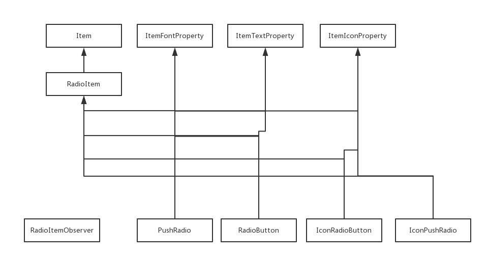

## RadioItem Inheritance Diagram



### Example
* [demo](../../../Scripts/Tests/dg_radio_test.py)

### Testing
```
import Tests.dg_radio_test as radio_test

class PyMain(object):
    def __init__(self):
        print "PyMain.__init__" #must be print this message
        pass

    def RegisterInterface(self):
        print 'PyMain.RegisterInterface' #must be print this message
        pass
    
    def Initialize(self,reload):
        #new Form
        self.frm=radio_test.Form()
        print 'PyMain.Initialize' #must be print this message
        pass

    def FreeData(self):
        #free Form
        self.frm=None
        print 'PyMain.FreeData' #must be print this message
        pass

```

## Class List

* [RadioItem](RadioItem.md)
* [RadioItemObserver](RadioItem_Observer.md)
* [RadioButton](RadioButton.md)
* [IconRadioButton](IconRadioButton.md)
* [PushRadio](PushRadio.md)
* [IconPushRadio](IconPushRadio.md)

