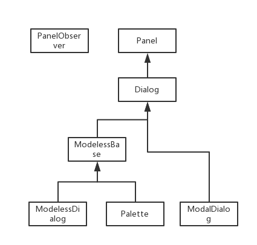

## Panel Class

### Form Inheritance Diagram



### Children Class
[Dialog](ArchicadDG_Dialog.md)

### Import
```
from ArchicadDG import Panel
``` 

### Class Functions

* **constructor()**
* Class constructor.
```

```

* **IsValid()**
* **Boolean**
* Checks the valid status of the panel.
```

```


* **IsExist()**
* **Boolean**
* Checks the exist status of the panel.

```

```

* **GetId()**
* **short**
* Retrieves the panel ID.

```

```

* **GetResourceId()**
* **short**
* Retrieves the resource ID of the panel.

```

```

* **GetAnchorString()**
* **string**
* Reads anchor string of the dialog from 'DLGH' resource.

```

```

* **GetItemCount()**
* **short**
* Retrieves the number of dialog items on the panel.

```

```

* **GetItem(short index)**
* **[ArchicadDG.Item](ArchicadDG_Item.md)**
* Retrieves the pointer of a dialog item specified by the given index.

```

```

* **GetWidth()**
* **short**
* Retrieves the width of the panel.

```

```

* **GetHeight()**
* **short**
* Retrieves the heigth of the panel.

```

```

* **ClearFocus()**
* **None**
* Removes the keyboard focus from the currently focused dialog item on the panel.

```

```

* **ShowItems()**
* **None**
* Shows the items on the panel.

```

```

* **HideItems()**
* **None**
* Hides all dialog items on the panel.

```

```

* **SetItemVisibility(Boolean show)**
* **None**
* Sets the visibility state of all dialog items on the panel.

```

```

* **MaskItemsVisibility(Boolean mask)**
* **None**
* Masks the visibility state of all dialog items on the panel.

```

```

* **EnableItems()**
* **None**
* Enables all dialog items on the panel.

```

```

* **DisableItems()**
* **None**
* Disables all dialog items on the panel.

```

```

* **SetItemStatus(Boolean enable)**
* **None**
* Sets the enabled/disabled status of all dialog items on the panel.

```

```

* **MoveItems(short hDisp,short vDisp)**
* **None**
* Moves all dialog items on the panel with the given relative values.

```

```

* **RedrawItems()**
* **None**
* Redraws all dialog items on the panel.

```

```

* **RegisterHotKey([ArchicadDG.Key.Special](ArchicadDG_Key_Special.md) key,[ArchicadDG.Key.Modifier](ArchicadDG_Key_Modifier.md) mod1,[ArchicadDG.Key.Modifier](ArchicadDG_Key_Modifier.md) mod2,[ArchicadDG.Key.Modifier](ArchicadDG_Key_Modifier.md) mod3)**
* **short**
* Registers a hotkey to the panel.

```

```

* **RegisterHotKey(short key,[ArchicadDG.Key.Modifier](ArchicadDG_Key_Modifier.md) mod1,[ArchicadDG.Key.Modifier](ArchicadDG_Key_Modifier.md) mod2,[ArchicadDG.Key.Modifier](ArchicadDG_Key_Modifier.md) mod3)**
* **short**
* Registers a hotkey to the panel.

```

```

* **UnregisterHotKey(short hotKeyId)**
* **None**
* Unregisters a hotkey of the panel.

```

```

* **EnableHotKeys()**
* **None**
* Enables hotkeys registered to the panel.

```

```

* **DisableHotKeys()**
* **None**
* Disables hotkeys registered to the panel.

```

```

* **EnableDragAndDropEvent()**
* **None**
* Enables receiving drag and drop events.

```

```

* **EnableInputFiltering()**
* **None**
* Enables receiving input filter events.

```

```

* **DisableInputFiltering()**
* **None**
* Disables receiving input filter events.

```

```

* **GetResolutionFactor()**
* **short**
* Retrieves the resolution factor of the panel.

```

```

* **IsDGDialog()**
* **Boolean**
* Retrieves the is DGDialog of the panel.

```

```

* **IsSystemDialog()**
* **Boolean**
* Retrieves the is SystemDialog of the panel.

```

```

* **IsTabPage()**
* **Boolean**
* Retrieves the is TabPage of the panel.

```

```
