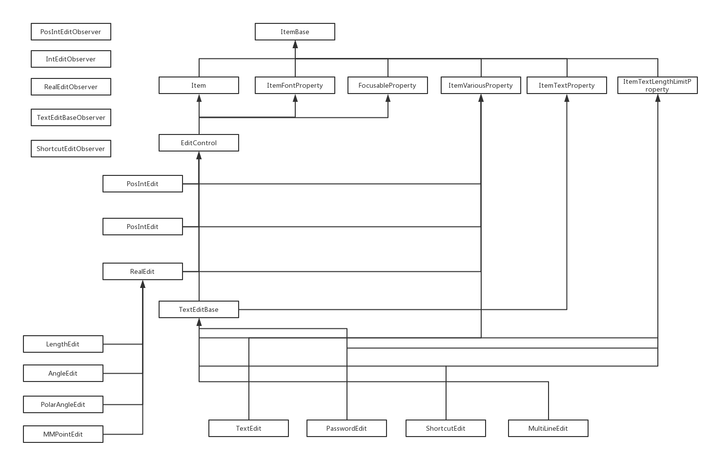

## EditControl Class

### Edit Control Inheritance Diagram




### Parent Class
* [Item](../ArchicadDG_Item.md)
* [ItemFontProperty](../ArchicadDG_ItemFontProperty.md)
* [FocusableProperty](../ArchicadDG_FocusableProperty.md)

### Children Class
* [PosIntEdit](ArchicadDG_PosIntEdit.md)
* [IntEdit](ArchicadDG_IntEdit.md)
* [RealEdit](ArchicadDG_RealEdit.md)
* [TextEditBase](ArchicadDG_TextEditBase.md)

### Import
```
from ArchicadDG import EditControl
``` 
