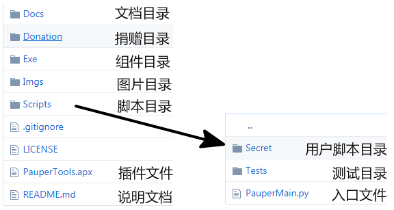
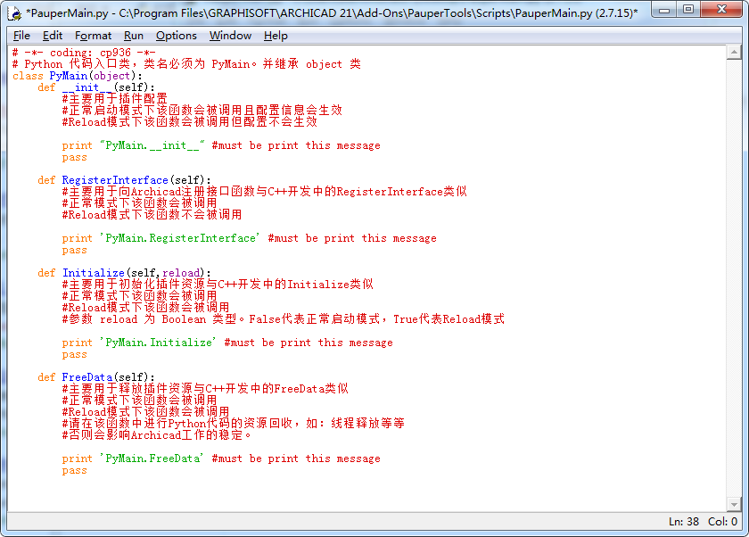
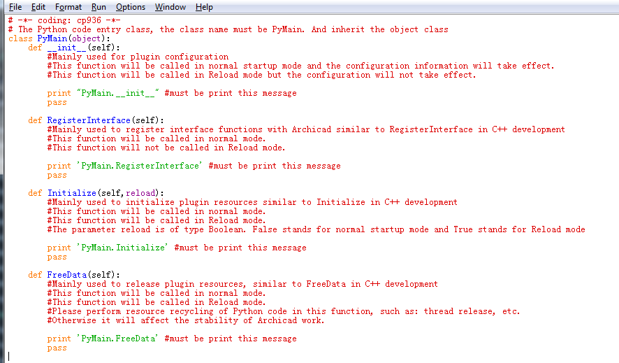

## Plugin Using

### Directory Structure

* **Docs**：Mainly used for storage project documentation.
* **Donation**：Mainly used for storage of donor information.
* **Exe**：Mainly used to store must install **Component** installation package.
* **Imgs**：Mainly used to store project pictures.
* **Scripts**：Mainly contains the script files related to Python.
* **Scripts/Secret**：Mainly used to store user scripts (*.py files in this directory will be ignored by git)
* **Scripts/Tests**：Mainly used to store usage and test examples.
* **Scripts/PauperMain.py**：The startup file for the Python code.
* **PauperTools.apx**：Establish "Archicad.exe" and "Scripts / PauperMain.py" bridging relations.

### PauperMain

### Output information

* **文件->信息->阶段报告**
* **File->Info->Session Report**

### Reload Mode

* **Some work windows can't click the button, just switch the work window.**

